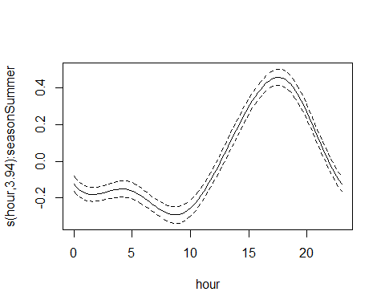
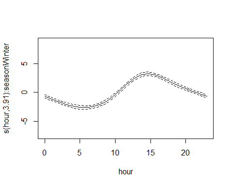

Graphic Summaries of Diurnal Patterns in Sonde Data From FOCB
================
Curtis C. Bohlen, Casco Bay Estuary Partnership
12/14/2021

-   [Introduction](#introduction)
-   [Load Libraries](#load-libraries)
-   [Load Data](#load-data)
    -   [Establish Folder Reference](#establish-folder-reference)
    -   [Load The Data](#load-the-data)
        -   [Primary Data](#primary-data)
    -   [Transformed Chlorophyll Data](#transformed-chlorophyll-data)
    -   [Add Season Factor](#add-season-factor)
    -   [Calculate Diurnal Deviations](#calculate-diurnal-deviations)
-   [Color Palette For Seasonal
    Display](#color-palette-for-seasonal-display)
-   [DO Ribbon Graphics](#do-ribbon-graphics)
    -   [Run the GAMM](#run-the-gamm)
        -   [Group by `season + year_f`](#group-by-season--year_f)
        -   [Group by `season`](#group-by-season)
    -   [Generate Predictions from the
        Model](#generate-predictions-from-the-model)
    -   [Create Ribbon Graphic](#create-ribbon-graphic)
    -   [Graphic with Points](#graphic-with-points)
-   [Run GAM models for Other
    Parameters](#run-gam-models-for-other-parameters)
    -   [Temperature](#temperature)
    -   [Salinity](#salinity)
    -   [Percent Saturation](#percent-saturation)
    -   [pH](#ph)
    -   [Chlorophyll (Transformed)](#chlorophyll-transformed)


# Introduction

This Notebook provides graphic summaries of data from Friends of Casco
Bay’s “CMS1” monitoring location, on Cousins Island, in Casco Bay,
Maine. We focus here on analysis of primary sonde data on temperature,
dissolved oxygen, salinity, and chlorophyll A.

Specifically, we look at diurnal patterns by looking at deviations from
daily median value. This highlights the diurnal signal buried in the
high frequency data.

# Load Libraries

``` r
library(tidyverse)
#> Warning: package 'tidyverse' was built under R version 4.0.5
#> -- Attaching packages --------------------------------------- tidyverse 1.3.1 --
#> v ggplot2 3.3.5     v purrr   0.3.4
#> v tibble  3.1.6     v dplyr   1.0.7
#> v tidyr   1.1.4     v stringr 1.4.0
#> v readr   2.1.0     v forcats 0.5.1
#> Warning: package 'ggplot2' was built under R version 4.0.5
#> Warning: package 'tidyr' was built under R version 4.0.5
#> Warning: package 'dplyr' was built under R version 4.0.5
#> Warning: package 'forcats' was built under R version 4.0.5
#> -- Conflicts ------------------------------------------ tidyverse_conflicts() --
#> x dplyr::filter() masks stats::filter()
#> x dplyr::lag()    masks stats::lag()
library(readxl)

library(mgcv)      # for gam() and gamm() models
#> Warning: package 'mgcv' was built under R version 4.0.5
#> Loading required package: nlme
#> 
#> Attaching package: 'nlme'
#> The following object is masked from 'package:dplyr':
#> 
#>     collapse
#> This is mgcv 1.8-38. For overview type 'help("mgcv-package")'.

library(GGally)
#> Warning: package 'GGally' was built under R version 4.0.5
#> Registered S3 method overwritten by 'GGally':
#>   method from   
#>   +.gg   ggplot2
library(lubridate)  # here, for the make_datetime() function
#> Warning: package 'lubridate' was built under R version 4.0.5
#> 
#> Attaching package: 'lubridate'
#> The following objects are masked from 'package:base':
#> 
#>     date, intersect, setdiff, union

library(CBEPgraphics)
load_cbep_fonts()
theme_set(theme_cbep())
```

# Load Data

## Establish Folder Reference

``` r
sibfldnm <- 'Data'
parent   <- dirname(getwd())
sibling  <- file.path(parent,sibfldnm)

dir.create(file.path(getwd(), 'figures'), showWarnings = FALSE)
dir.create(file.path(getwd(), 'models'), showWarnings = FALSE)
```

## Load The Data

We need to skip the second row here, which is inconvenient largely
because the default “guess” of data contents for each column is based on
the contents of that first row of data.

A solution in an answer to this stack overflow questions
<https://stackoverflow.com/questions/51673418/how-to-skip-the-second-row-using-readxl>)
suggests reading in the first row only to generate names, then skip the
row of names and the row of units, and read the “REAL” data. Note that
we round the timestamp on the data to the nearest hour.

In earlier work, I found some inconsistencies in how daylight savings
time was dealt with.

For some reason, excel is not reading in the dates and times correctly.
I have to reconstruct the time from components. I am not certain of the
timezone setting to read these files in correctly.

### Primary Data

``` r
fn    <- 'CMS1 Data through 2019.xlsx'
fpath <- file.path(sibling,fn)

mynames <- read_excel(fpath, sheet = 'Sheet1', n_max = 1, col_names = FALSE)
#> New names:
#> * `` -> ...1
#> * `` -> ...2
#> * `` -> ...3
#> * `` -> ...4
#> * `` -> ...5
#> * ...
mynames <- unname(unlist(mynames[1,]))  # flatten and simplify
mynames[2] <- 'datetime'               # 
mynames[4] <- 'depth'                   # Address non-standard names
mynames[8] <- 'pctsat'
mynames[18] <- 'omega_a'
mynames <- tolower(mynames)             # convert all to lower case

the_data <- read_excel(fpath, skip=2, col_names = FALSE)
#> New names:
#> * `` -> ...1
#> * `` -> ...2
#> * `` -> ...3
#> * `` -> ...4
#> * `` -> ...5
#> * ...
names(the_data) <- mynames
rm(mynames)
```

We create an independent time stamp based on recorded year, month, day,
etc. to directly address ambiguities of how dates and times are imported
with daylight savings time, etc. The parameter `tz = "America/New_York"`
creates a time stamp that is tied to local time. The time stamp under
the hood is a numerical value, but with this timezone specification, the
text form accounts for local daylight savings time.

``` r
the_data <- the_data %>%
  select(-count)  %>%    # datetime and time contain the same data
  mutate(dt = make_datetime(year, month, day, hour, 0, tz = "America/New_York")) %>%
  select(-datetime, -time) %>%
  relocate(c(ta, dic, omega_a) , .after = "pco2") %>%
  mutate(thedate  = as.Date(dt),
         doy      = as.numeric(format(dt, format = '%j')),
         # tstamp   = paste0(year, '/', sprintf("%02d", month), '/',
         #                   sprintf("%02d", day), ' ', sprintf("%02d", hour)),
         month = factor(month, labels = month.abb),
         year_f = factor(year)) %>%
  relocate(dt, thedate, year, year_f,month, day, hour, doy) %>%
  arrange(dt)                # Force data are in chronological order
```

## Transformed Chlorophyll Data

For our data based on FOCB’s surface water (grab sample) data, we
presented analyses not of raw chlorophyll data, but analysis of log
(Chlorophyll + 1) data. The transformed values better correspond to
assumptions of normality used is statistical analyses. We provide a
transformed version here so that we can produce graphics that are
visually consistent in terms of presentation.

``` r
the_data <- the_data %>%
  mutate(chl_log1 = log1p(chl)) %>%
  relocate(chl_log1, .after = chl)
```

## Add Season Factor

``` r
the_data <- the_data %>%
  mutate(season = recode_factor(month, 
                                Jan  = 'Winter',
                                Feb  = 'Winter',
                                Mar  = 'Spring',
                                Apr  = 'Spring',
                                May  = 'Spring',
                                Jun  = 'Summer',
                                Jul  = 'Summer',
                                Aug  = 'Summer',
                                Sep  = 'Fall',
                                Oct = 'Fall',
                                Nov = 'Fall',
                                Dec = 'Winter'
                                )) %>%
   mutate(season = factor(season, levels = c('Winter', 
                                             'Spring', 
                                             'Summer', 
                                             'Fall')))
```

## Calculate Diurnal Deviations

[Back to top](#) Because of highly skewed data distributions for some
variables, we calculate deviations from daily medians here.

``` r
dev_data <- the_data %>%
  group_by(year, month, day) %>%
  
  # Calculate sample sizes for each day.
  mutate(across(temperature:chl_log1, ~ sum(! is.na(.x)), .names = "{.col}_n")) %>%
  mutate(across(temperature:chl_log1, median, na.rm = TRUE, .names = "{.col}_median")) %>%
  ungroup(year, month, day) %>%

  mutate(temperature_dev = temperature - temperature_median) %>%
  mutate(salinity_dev = salinity - salinity_median) %>%
  mutate(do_dev = do - do_median) %>%
  mutate(pctsat_dev = pctsat - pctsat_median) %>%
  mutate(ph_dev = ph - ph_median) %>%
  mutate(chl_dev = chl - chl_median) %>%
  mutate(chl_log1_dev = chl_log1 - chl_log1_median) %>%

  
  # Replace data from any days with less than 20 hours of data with NA
  mutate(temperature_dev  = if_else(temperature_n < 20, NA_real_, temperature_dev)) %>%
  mutate(salinity_dev = if_else(salinity_n    < 20, NA_real_, salinity_dev)) %>%
  mutate(do_dev       = if_else(do_n          < 20, NA_real_, do_dev)) %>%
  mutate(pctsat_dev   = if_else(pctsat_n      < 20, NA_real_, pctsat_dev)) %>%
  mutate(ph_dev       = if_else(ph_n          < 20, NA_real_, ph_dev)) %>%
  mutate(chl_dev      = if_else(chl_n         < 20, NA_real_, chl_dev)) %>%
  mutate(chl_log1_dev = if_else(chl_log1_n    < 20, NA_real_, chl_log1_dev)) %>%

  # Delete the daily sample size variable
  select(-contains("_n"))
```

# Color Palette For Seasonal Display

This is just a list, not a function like `cbep_colors()`.

``` r
season_palette = c(cbep_colors()[1],
                    cbep_colors()[4],
                    cbep_colors()[2],
                    'orange')
```

# DO Ribbon Graphics

## Run the GAMM

We can not fit a GAMM here without subdividing the data with a grouping
structure. Without groups, the model requires too much memory, and
crashes the computer. We try a couple of different models , to check if
the particular subdivisions we choose makes any difference.

Note that because we save a version of the model (to avoid rerunning
this every time we alter anything in the Notebook), you need to delete
the associated file to force recalculation.

The particular autocorrelation function we include here assumes a
complete data series (i.e., no gaps). This is not strictly correct here,
but it is close, and fitting a full model by date consumes too much
memory.

331 seconds \~ 5 minutes with season and year in the correlation
structure. 1154 seconds \~ 20 minutes with only season in the covariate
structure.

### Group by `season + year_f`

This takes on the order of five minutes to run.

``` r
if (! file.exists('models/do_gam.rds')) {
tm <- system.time(do_gam <- gamm(do_dev ~  s(hour, by = season, bs='cc', k=6),
                 correlation = corAR1(form = ~ 1 | season + year_f),  # we run out of memory if we don't use a grouping
                 data = dev_data))
  saveRDS(do_gam, 'models/do_gam.rds')
  print(tm)
  rm(tm)
} else {
  do_gam <- readRDS('models/do_gam.rds')
}
```

``` r
do_gam$lme$modelStruct$corStruct
#> Correlation structure of class corAR1 representing
#>       Phi 
#> 0.5710958
```

### Group by `season`

The following takes \~ 20 minutes to run (Windows 10, 64 bit, Intel i7
processor, 2.4 GHz). We prefer the other model, largely because it runs
much faster, and because it reflects a more appropriate correlation
structure for these data.

OUr primary reason for running this model is just to check if grouping
affects our estimates or the estimates of the correlation parameter
substantially.

``` r
if (! file.exists('models/do_gam_2.rds')) {
tm <- system.time(do_gam_2 <- gamm(do_dev ~  s(hour, by = season, bs='cc', k=6),
                 correlation = corAR1(form = ~ 1 | season),  # we run out of memory if we don't use a grouping
                 data = dev_data))
  saveRDS(do_gam_2, 'models/do_gam_2.rds')
  print(tm)
  rm(tm)
} else {
  do_gam_2 <- readRDS('models/do_gam_2.rds')
}
```

``` r
do_gam_2$lme$modelStruct$corStruct
#> Correlation structure of class corAR1 representing
#>       Phi 
#> 0.5709678
```

So the estimate of the correlation structure differs only in the fourth
decimal place.

``` r
cbind(coef(do_gam$gam), coef(do_gam_2$gam))
#>                                 [,1]          [,2]
#> (Intercept)            -0.0001534502 -0.0002454796
#> s(hour):seasonWinter.1 -0.2246408129 -0.2245506936
#> s(hour):seasonWinter.2 -0.0899873367 -0.0898800294
#> s(hour):seasonWinter.3  0.3216627552  0.3217707095
#> s(hour):seasonWinter.4  0.1775077444  0.1776027460
#> s(hour):seasonSpring.1 -0.2906732082 -0.2906115949
#> s(hour):seasonSpring.2 -0.0624744803 -0.0624016991
#> s(hour):seasonSpring.3  0.3610278710  0.3611011321
#> s(hour):seasonSpring.4  0.2709000023  0.2709653563
#> s(hour):seasonSummer.1 -0.4741390373 -0.4738301094
#> s(hour):seasonSummer.2 -0.3206853600 -0.3203336731
#> s(hour):seasonSummer.3  0.4916091632  0.4919664648
#> s(hour):seasonSummer.4  0.5363296920  0.5366455206
#> s(hour):seasonFall.1   -0.2991932112 -0.2991461920
#> s(hour):seasonFall.2   -0.2184358163 -0.2183801542
#> s(hour):seasonFall.3    0.3758938204  0.3759519942
#> s(hour):seasonFall.4    0.3725599372  0.3726132310
```

Again, differences are mostly in the fourth decimal place, so there is
little value to the slower model.

``` r
rm(do_gam_2)
```

## Generate Predictions from the Model

``` r
newdat <- expand.grid(hour = seq(0, 23),
                    season = c('Winter', 'Spring', 'Summer', 'Fall'))
p <- predict(do_gam$gam, newdata = newdat, se.fit=TRUE)
newdat <- newdat %>%
  mutate(pred = p$fit, se = p$se.fit)
```

## Create Ribbon Graphic

The ribbon plot shows approximate 95% confidence intervals for the GAMM
fits by season.

``` r
ggplot(newdat, aes(x=hour, y=pred, color = season)) + #geom_line() +
  geom_ribbon(aes(ymin = pred-(1.96*se),
                  ymax = pred+(1.96*se),
                  fill = season), alpha = 0.5,
              color = NA) +
  
  theme_cbep(base_size= 12) +
  theme(legend.key.width = unit(0.1,"in"),
        legend.key.height = unit(0.1,"in"),
        legend.text      = element_text(size = 10),
        legend.position = c(0.75, 0.25)) +
  scale_fill_manual(values = season_palette, name = '') +
  scale_color_manual(values = season_palette, name = '') +

  scale_x_continuous(limits = c(0,24),  breaks = c(0,6,12,18,24)) +

  
  xlab('Hour of Day') +
  ylab('Dissolved Oxygen (mg/l)\n Difference from Daily Median')
```


``` r
ggsave('figures/do_diurnal_seasons.pdf', device = cairo_pdf, 
       width = 3, height = 3)
```

## Graphic with Points

``` r
ggplot(newdat, aes(x=hour, y=pred, color = season)) + #geom_line() +
  geom_jitter(data = dev_data, mapping = aes(x = hour, y = do_dev, color = season),
             width = 0.2, height = 0, alpha = 0.2, size = 0.5) +
  geom_ribbon(aes(ymin = pred-(1.96*se),
                  ymax = pred+(1.96*se),
                  fill = season), alpha = 1,
              color = NA) +
  
  theme_cbep(base_size= 12) +
  theme(legend.key.width = unit(0.1,"in"),
        legend.key.height = unit(0.1,"in"),
        legend.text      = element_text(size = 10),
        legend.position = c(0.75, 0.25)) +
  scale_fill_manual(values = season_palette, name = '') +
  scale_color_manual(values = season_palette, name = '') +

  scale_x_continuous(limits = c(0,24),  breaks = c(0,6,12,18,24)) +

  
  xlab('Hour of Day') +
  ylab('Dissolved Oxygen (mg/l)\n Difference from Daily Median')
#> Warning: Removed 1713 rows containing missing values (geom_point).
```


``` r
ggsave('figures/do_diurnal_seasons_dots.pdf', device = cairo_pdf, width = 4, height = 4)
#> Warning: Removed 1739 rows containing missing values (geom_point).
```

# Run GAM models for Other Parameters

We tried to work in nested tibbles, only to run into memory management
issues. We fall back on running similar code for several of the
remaining parameters. here we do not generate predictions, only output
model summaries and plot GAM smoothers for inspection.

``` r
rm(do_gam)
```

## Temperature

``` r
if (! file.exists('models/temperature_gam.rds')) {
tm <- system.time(temperature_gam <- gamm(temperature_dev ~  s(hour, 
                                                               by = season,
                                                               bs='cc', k=6),
                 correlation = corAR1(form = ~ 1 | season + year_f),  # we run out of memory if we don't use a grouping
                 data = dev_data))
  saveRDS(temperature_gam, 'models/temperature_gam.rds')
  print(tm)
  rm(tm)
} else {
  temperature_gam <- readRDS('models/temperature_gam.rds')
}
```

``` r
summary(temperature_gam$gam)
#> 
#> Family: gaussian 
#> Link function: identity 
#> 
#> Formula:
#> temperature_dev ~ s(hour, by = season, bs = "cc", k = 6)
#> 
#> Parametric coefficients:
#>             Estimate Std. Error t value Pr(>|t|)
#> (Intercept) 0.006165   0.007118   0.866    0.386
#> 
#> Approximate significance of smooth terms:
#>                        edf Ref.df      F p-value    
#> s(hour):seasonWinter 3.509      4  11.22  <2e-16 ***
#> s(hour):seasonSpring 3.848      4  59.65  <2e-16 ***
#> s(hour):seasonSummer 3.945      4 119.77  <2e-16 ***
#> s(hour):seasonFall   3.635      4  29.09  <2e-16 ***
#> ---
#> Signif. codes:  0 '***' 0.001 '**' 0.01 '*' 0.05 '.' 0.1 ' ' 1
#> 
#> R-sq.(adj) =  0.0871   
#>   Scale est. = 0.32112   n = 29768
```

``` r
plot(temperature_gam$gam)
```



``` r
rm(temperature_gam)
```

## Salinity

``` r
if (! file.exists('models/salinity_gam.rds')) {
tm <- system.time(salinity_gam <- gamm(salinity_dev ~  s(hour, 
                                                         by = season, 
                                                         bs='cc', k=6),
                 correlation = corAR1(form = ~ 1 |  season + year_f),  # we run out of memory if we don't use a grouping
                 data = dev_data))
  saveRDS(salinity_gam, 'models/salinity_gam.rds')
  print(tm)
  rm(tm)
} else {
  salinity_gam <- readRDS('models/salinity_gam.rds')
}
```

``` r
summary(salinity_gam$gam)
#> 
#> Family: gaussian 
#> Link function: identity 
#> 
#> Formula:
#> salinity_dev ~ s(hour, by = season, bs = "cc", k = 6)
#> 
#> Parametric coefficients:
#>              Estimate Std. Error t value Pr(>|t|)    
#> (Intercept) -0.016207   0.004082   -3.97  7.2e-05 ***
#> ---
#> Signif. codes:  0 '***' 0.001 '**' 0.01 '*' 0.05 '.' 0.1 ' ' 1
#> 
#> Approximate significance of smooth terms:
#>                            edf Ref.df     F p-value    
#> s(hour):seasonWinter 5.485e-06      4 0.000 0.83406    
#> s(hour):seasonSpring 3.733e+00      4 9.176 < 2e-16 ***
#> s(hour):seasonSummer 4.026e-05      4 0.000 0.56355    
#> s(hour):seasonFall   3.035e+00      4 2.598 0.00983 ** 
#> ---
#> Signif. codes:  0 '***' 0.001 '**' 0.01 '*' 0.05 '.' 0.1 ' ' 1
#> 
#> R-sq.(adj) =  0.00351   
#>   Scale est. = 0.082014  n = 29240
```

``` r
plot(salinity_gam$gam)
```


``` r
rm(salinity_gam)
```

## Percent Saturation

``` r
if (! file.exists('models/pctsat_gam.rds')) {
tm <- system.time(pctsat_gam <- gamm(pctsat_dev ~  s(hour, 
                                                     by = season, 
                                                     bs='cc', k=6),
                 correlation = corAR1(form = ~ 1 |  season + year_f),  # we run out of memory if we don't use a grouping
                 data = dev_data))
  saveRDS(pctsat_gam, 'models/pctsat_gam.rds')
  print(tm)
  rm(tm)
} else {
  pctsat_gam <- readRDS('models/pctsat_gam.rds')
}
```

``` r
summary(pctsat_gam$gam)
#> 
#> Family: gaussian 
#> Link function: identity 
#> 
#> Formula:
#> pctsat_dev ~ s(hour, by = season, bs = "cc", k = 6)
#> 
#> Parametric coefficients:
#>             Estimate Std. Error t value Pr(>|t|)
#> (Intercept)  0.06454    0.04431   1.457    0.145
#> 
#> Approximate significance of smooth terms:
#>                        edf Ref.df      F p-value    
#> s(hour):seasonWinter 3.907      4  141.4  <2e-16 ***
#> s(hour):seasonSpring 3.922      4  265.9  <2e-16 ***
#> s(hour):seasonSummer 3.984      4 1224.3  <2e-16 ***
#> s(hour):seasonFall   3.969      4  551.4  <2e-16 ***
#> ---
#> Signif. codes:  0 '***' 0.001 '**' 0.01 '*' 0.05 '.' 0.1 ' ' 1
#> 
#> R-sq.(adj) =  0.468   
#>   Scale est. = 16.224    n = 29094
```

``` r
plot(pctsat_gam$gam)
```



``` r
rm(pctsat_gam)
```

## pH

``` r
if (! file.exists('models/ph_gam.rds')) {
tm <- system.time(ph_gam <- gamm(ph_dev ~  s(hour, 
                                             by = season, 
                                             bs='cc', k=6),
                 correlation = corAR1(form = ~ 1 |  season + year_f),  # we run out of memory if we don't use a grouping
                 data = dev_data))
  saveRDS(ph_gam, 'models/ph_gam.rds')
  print(tm)
  rm(tm)
} else {
  ph_gam <- readRDS('models/ph_gam.rds')
}
```

``` r
summary(ph_gam$gam)
#> 
#> Family: gaussian 
#> Link function: identity 
#> 
#> Formula:
#> ph_dev ~ s(hour, by = season, bs = "cc", k = 6)
#> 
#> Parametric coefficients:
#>               Estimate Std. Error t value Pr(>|t|)
#> (Intercept) -0.0004991  0.0003980  -1.254     0.21
#> 
#> Approximate significance of smooth terms:
#>                        edf Ref.df     F p-value    
#> s(hour):seasonWinter 3.833      4  84.0  <2e-16 ***
#> s(hour):seasonSpring 3.876      4 159.9  <2e-16 ***
#> s(hour):seasonSummer 3.958      4 466.1  <2e-16 ***
#> s(hour):seasonFall   3.933      4 235.2  <2e-16 ***
#> ---
#> Signif. codes:  0 '***' 0.001 '**' 0.01 '*' 0.05 '.' 0.1 ' ' 1
#> 
#> R-sq.(adj) =  0.288   
#>   Scale est. = 0.0011952  n = 29117
```

``` r
plot(ph_gam$gam)
```


``` r
rm(ph_gam)
```

## Chlorophyll (Transformed)

``` r
if (! file.exists('models/chl_log1_gam.rds')) {
tm <- system.time(chl_log1_gam <- gamm(chl_log1_dev ~  s(hour, 
                                                         by = season, 
                                                         bs='cc', k=6),
                 correlation = corAR1(form = ~ 1 |  season + year_f),  # we run out of memory if we don't use a grouping
                 data = dev_data))
  saveRDS(chl_log1_gam, 'models/chl_log1_gam.rds')
  print(tm)
  rm(tm)
} else {
  chl_log1_gam <- readRDS('models/chl_log1_gam.rds')
}
```

``` r
summary(chl_log1_gam$gam)
#> 
#> Family: gaussian 
#> Link function: identity 
#> 
#> Formula:
#> chl_log1_dev ~ s(hour, by = season, bs = "cc", k = 6)
#> 
#> Parametric coefficients:
#>             Estimate Std. Error t value Pr(>|t|)    
#> (Intercept)  0.01575    0.00257   6.127 9.08e-10 ***
#> ---
#> Signif. codes:  0 '***' 0.001 '**' 0.01 '*' 0.05 '.' 0.1 ' ' 1
#> 
#> Approximate significance of smooth terms:
#>                        edf Ref.df     F p-value    
#> s(hour):seasonWinter 3.725      4 32.33  <2e-16 ***
#> s(hour):seasonSpring 3.776      4 65.57  <2e-16 ***
#> s(hour):seasonSummer 3.793      4 85.76  <2e-16 ***
#> s(hour):seasonFall   3.730      4 54.81  <2e-16 ***
#> ---
#> Signif. codes:  0 '***' 0.001 '**' 0.01 '*' 0.05 '.' 0.1 ' ' 1
#> 
#> R-sq.(adj) =  0.0576   
#>   Scale est. = 0.098339  n = 29375
```

``` r
plot(chl_log1_gam$gam)
```


``` r
rm(chl_log1_gam)
```

So, what we see:  
\* On the order of 1/2 degree C fluctuations in water temperature with
day during summer, lower levels of fluctuations at other times of year.
\* Close to 15% fluctuation in percent saturation over summer days, with
minimum percent saturation at dawn, maximum in late afternoon. \*
Similar fluctuations in pH, although the total swing is less than 1/10th
of a pH point.
